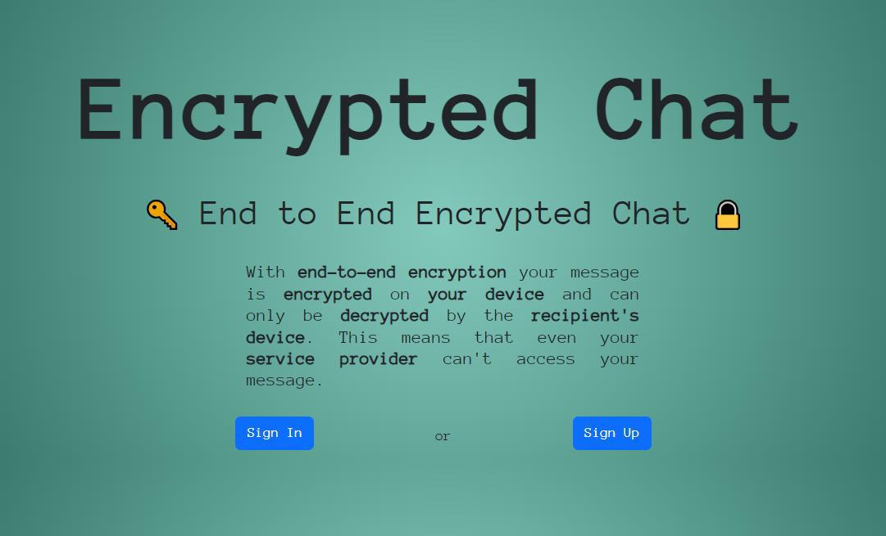

# Encrypted Chat Application

## About

Real-time messaging application that ensures privacy and security through end-to-end encryption. Messages are encrypted on the sender's device and can only be decrypted by the recipient, meaning not even the service provider has access to the message content.

## Features

- End-to-End Encryption: Messages are encrypted with AES encryption using a secret passphrase.
- Real-Time Messaging: Communicate instantly with others without delays.
- Image Sharing: Send images securely with automatic resizing and encryption.
- User Authentication: Secure signup and login processes using bcrypt for password hashing.

## Installation

1. Clone the repository:

```bash
git clone https://github.com/yourusername/encrypted-chat.git
```

2. Install dependencies:

```bash
npm install
```

3. Configure your MongoDB connection. Replace the following line in `server.js` with your MongoDB URI:

```javascript
mongoose.connect('YOUR_MONGODB_URI', { useNewUrlParser: true, useUnifiedTopology: true });
```

4. Start the server:

```bash
node server.js
```

5. Visit `http://localhost:3000` on your browser to start using the app.

## Technologies Used

- Frontend:
  - HTML/CSS
  - Vanilla JavaScript
- Backend:
  - Node.js
  - Express.js
  - Socket.IO for real-time communication
- Database:
  - MongoDB with Mongoose
- Security:
  - CryptoJS for encryption/decryption
  - bcryptjs for password hashing

## Screenshots




## Contributions

Contributions are welcome! Please feel free to submit a pull request or create an issue for any bugs or feature suggestions.

## License

Distributed under the MIT License. See `license.txt` for more information.
